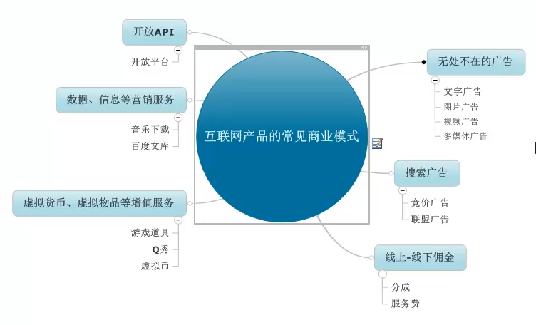

## 紀錄一些目前看起來是異想天開的想法
* 

#### 資料庫虛擬化技術
* 建立一個通用GateWay, 讓現有的程式可以任意切換不同的 Database

#### AI 開發應用系統
* 用口語或規範化的文字定義，由AI根據後台已有的模板，快速產生可執行程式

#### Tools Coding by store procedure 
* 將 orm 架構(sp) open source(ms-sql 或 mariadb 版)，賣書或 Donate 皆可
* 通用後端 API 平台(以 Store Procedure 為核心基礎)
* App CodeGen wizard(思考中) ==> 將原有的 Wizard 繼續延續生命
* 續上，能否參考 code Smith 的萬用模板定義程式，將 Wizard 改為真正的萬用，不必不斷的配合新的工具就不斷的改寫 Wizard 程式(或 store procedure)
  * 沿用 Template 架構
  * 想辦法將 @var@ 變數能夠透過自定義，能任意產生替代的變數
  * https://www.cnblogs.com/linxin/p/6509897.html
  繼續完成林鑫之前的樣板 wizard 化，要想辦法做到不寫 Code，只靠設定檔(可能要新增很多設定檔)，就能搞定絕大多數的 Wizard 程式

#### 三位一體的整合方案
* app 為尖兵，通用資料存取為基礎，配合後端平台為驅動。以自行開發的 Wizard為技術核心，不處理複雜邏輯，但提供多個系統為範本，以移動整合平台為中心思想，提供快速解決方案。
* 利用工具(或Wizard) 協助客戶將任何一套現有系統的資料轉為報表
  * 乍聽和 BI Tools 很像，主要差別是學習 Canva 的極簡做法，讓設計報表簡化到極簡(或是要針對無Web系統的ERP，如 chi等，提供基礎及客制方案)
    * 這個聽起來不容易，因為要寫報表必須先了解 Table Schema，這個問題應該無法簡化(或是要針對性的研究特定系統)
    * 較可行的方案仍是先不理會來源資料內容，純以面對 store procedure 或 view 來工具化處理，這應該是一般 BI 的標準做法，但是如此一來也就沒了特色，Canva 之所以好用，就是極簡，難度非常高，再繼續想想吧。
    * 找小一點或大陸公司或行銷較弱的公司合作，但是我自己的銷售網路也不強，資訊系統的競爭也非常激烈。

#### 行業別的雲端解決方案 
* 社區管理系統
  * 雲管家 http://www.56168.com.tw/product.html
* http://www.eztool.com.tw/index.aspx

#### 參考好文
* [How side projects saved our startup(thenextweb.com)](https://thenextweb.com/entrepreneur/2014/10/23/side-projects-saved-our-startup/1/)
* [台灣新創9傑——這些準獨角獸們](https://www.bnext.com.tw/article/60107/kneron-2020-special)

